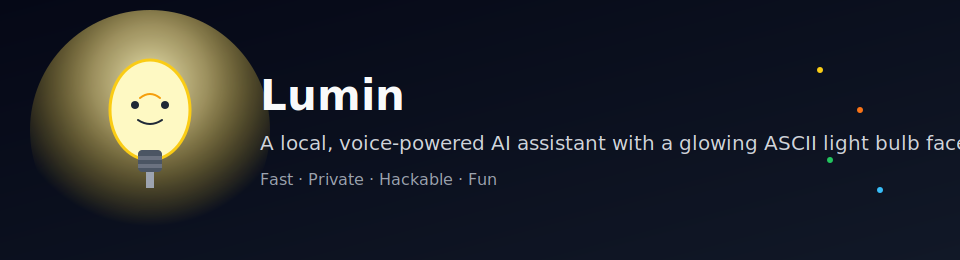

<p align="center">
  
</p>


🌟 Lumin — A Local, Modular, Voice‑Driven AI Assistant
A fully offline, privacy‑first, wake‑word‑activated assistant powered by Textual, Vosk, and Ollama.

Lumin is a local AI assistant designed to feel alive — a glowing bulb that listens, thinks, and speaks entirely on your machine. No cloud. No tracking. No external dependencies beyond the open‑source tools you choose.

This project is built for developers who want a hackable, modular, and fun voice assistant they can extend endlessly.

🚀 Features
🎤 Speech Recognition (STT)
Powered by Vosk (offline)

High‑pass filtering for clarity

Silence detection

Volume metering (for the filament meter)

Wake‑word detection:

“Lumin”

“Hey Lumin”

Control words:

stop / cancel

clear that / reset

listen again / start over

🧠 Local LLM Integration
Uses Ollama for fully local inference

Streaming token‑by‑token responses

Works with any installed Ollama model

🔊 Text‑to‑Speech (TTS)
Powered by pyttsx3

Non‑blocking threaded engine

Queue‑based speech

Wake‑word does not interrupt TTS

💡 Textual UI
Animated bulb widget (idle, listening, thinking, speaking)

Filament volume meter

Push‑to‑talk (Ctrl+M)

Always‑listen mode

🔐 Privacy‑First
Everything runs locally.
No cloud calls.
No telemetry.
Your voice never leaves your machine.

📁 Project Structure
Lumin is intentionally modular — each component lives in its own file for clarity and easy hacking.

```
lumin/
│
├── main.py              # Entry point, config loading, CLI overrides
├── stt.py               # Speech recognition + wake-word engine
├── tts.py               # Threaded text-to-speech engine
├── ollama_client.py     # Streaming LLM client for Ollama
└── ui_app.py            # Textual UI + assistant orchestration
```

Below is a breakdown of what each module does.

🧩 Module Overview
main.py
The entrypoint of the application.

Handles:

Argument parsing

Config loading (config.json)

Applying CLI overrides

Launching the Textual UI (LuminApp)

This file stays intentionally small and clean.

stt.py
The speech recognition engine.

Provides:

Vosk STT pipeline

Wake‑word detection (“Lumin”, “Hey Lumin”)

Stop / Clear / Listen‑Again detection

Silence detection

High‑pass filtering

Volume metering callback

Returns structured results:

"text"

"stop"

"clear"

"listen_again"

This module is the “ears” of Lumin.

tts.py
Threaded text‑to‑speech engine.

Features:

Non‑blocking speech

Internal queue

is_busy() flag (used by wake‑word logic)

Clean shutdown

No overlap between messages

This module is the “voice” of Lumin.

ollama_client.py
Handles communication with the local Ollama server.

Provides:

stream_chat(messages, on_token) for streaming responses

ask(messages) for synchronous responses

Automatic error handling

This module is the “brain” of Lumin.

ui_app.py
The heart of the assistant — the orchestrator.

Contains:

Textual UI

Bulb widget

Filament meter widget

Always‑listen loop

Push‑to‑talk (Ctrl+M)

Wake‑word acknowledgment (“I’m listening.”)

STT → LLM → TTS pipeline

Thread‑safe UI updates

State machine (idle, listening, thinking, speaking)

This module is the “body” of Lumin.

⚙️ Configuration
Create a config.json in the project root:

```json
{
  "model": "llama3.1",
  "ollama_url": "http://localhost:11434",
  "mic_device": 0,
  "listen_mode": "push_to_talk",

  "wake_words": ["hey lumin", "lumin"],
  "stop_words": ["stop", "cancel"],
  "clear_words": ["clear that", "reset"],
  "listen_again_words": ["listen again", "start over"],

  "vosk_model_path": "models/vosk",
  "silence_threshold": 3000,
  "silence_duration": 0.6
}
```

▶️ Running Lumin
From inside the lumin/ directory:

bash
python3 main.py
Optional CLI overrides:
bash
python3 main.py --model llama3.2
python3 main.py --mic 1
python3 main.py --listen-mode always
python3 main.py --ollama http://localhost:11435
🧪 Requirements
Install dependencies:

```bash
pip install sounddevice scipy vosk pyttsx3 textual requests numpy
You also need:

Vosk model
Download any English model and place it in models/vosk/.

Ollama
Install from: https://ollama.com
```

Then pull a model:

```bash
ollama pull llama3.1
```

🤝 Contributing
Lumin is intentionally modular — adding new features is easy:

Add new widgets

Add new wake‑words

Add new control words

Add new animations

Add new LLM tools

Add new commands (“turn on the lights”, “play music”, etc.)

PRs are welcome.
Ideas are welcome.
Experiments are encouraged.

💡 Final Thoughts
Lumin is more than a script — it’s a platform for building a local, expressive, voice‑driven AI companion.
You now have a clean, modular foundation that’s easy to extend and fun to hack on.

If you want:

A logo

A project banner

A CONTRIBUTING.md

A ROADMAP.md

A wiki layout

A “Getting Started” video script

A feature showcase GIF

Just say the word and I’ll craft it.

Lumin is alive — and you built it.

## ⭐ Final Notes

Lumin is early, but he’s already:
- Listening
- Thinking
- Speaking
- Animating
- And making people smile

If you want to help shape a local, open, creative AI assistant —

**welcome aboard.**

